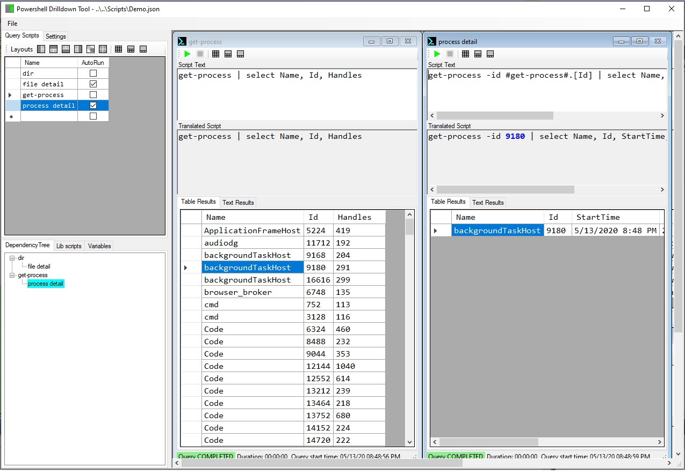

# PSDrilldownTool
Lightweight utility for running drilldown queries with powershell. Allows you to run a "master" query script, then run a 2nd drilldown "slave" query script based on results from the "master" query.

## Quickstart
1. Download the project
2. Build and execute, or execute the binary in Drop\PSDrilldownTool.exe
3. Click File\Open, and open the file Scripts\Demo.json, to see a GUI similar to the screenshot below. 

* Query scripts as added/removed in the "Query Scripts" tab in the in the upper right. Each script has a window in the right MDI window that contains the actual powershell and result windows, similar to a SQL Management Studio query window.
* In the Demo.json file, there are 4 scripts:
  1) dir - runs "dir" in the current folder
  2) file detail - gets detail for a single file selected in the "dir" result table. The token **#dir#.[Name]** is replaced with the Name column from the currently selected row from the "dir" result table.
  3) get-process - gets the executing processes on your machine
  4) process detail - gets detail for a single process selected in the "get-process" result table. The token **#get-process#.[Id]** is replaced with the Id column from the currently selected row from the "get-process" result table.
* The DependencyTree pane in the lower right shows that "file detail" depends on data from "dir" and "process detail" depends on data from "get-process"

4. Click on the green arrow in the "get-process" window to get the processes running on your computer.
5. In the upper left "Layouts" buttons, click on the first button (Master left) to position the "get-process" window to the left and "process-detail" to the right.
6. On the "get-process" window, click on any row in the Table Results and the "process detail" query script will automatically be executed to get details for your selected process. If you don't want the script to automatically execute, uncheck the "AutoRun" checkbox in the "Query Scripts" tab. You can then manually run the script by clicking the green arrow.
7. Add and remove query scripts by adding/removing items to the "Query Scripts" tab.
8. Save your configuration from the "File" menu.

